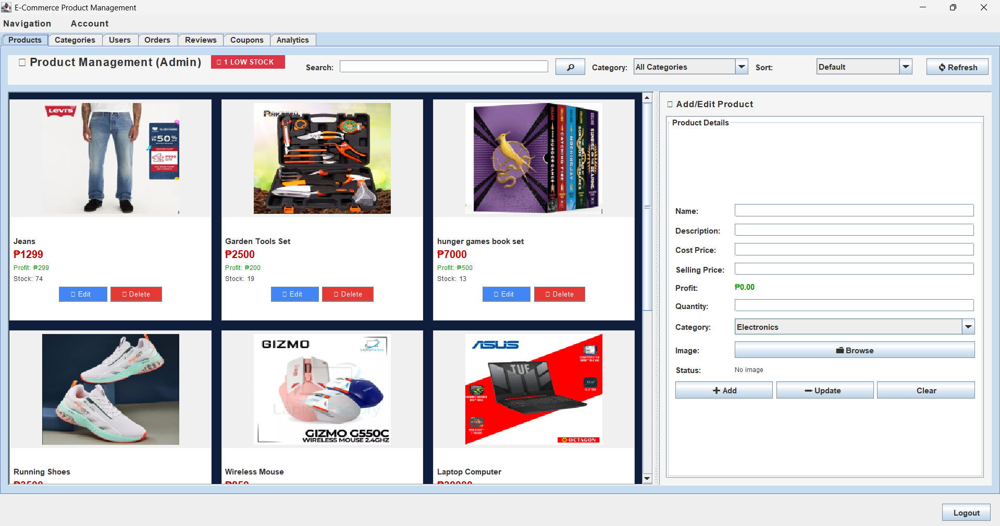
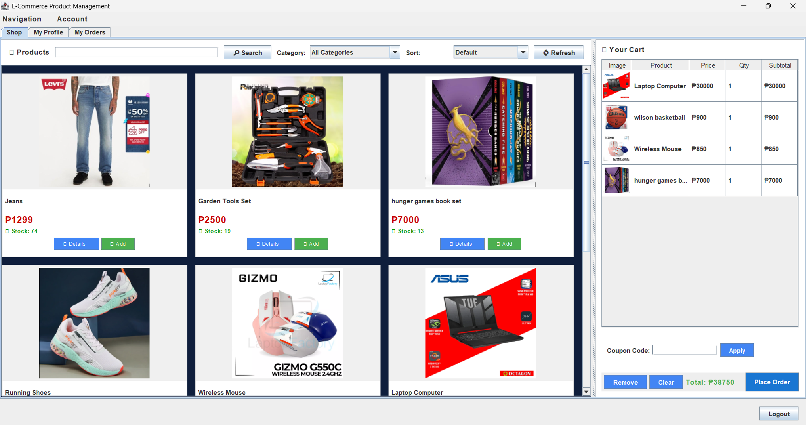

## ADMIN INTERFACE

  

## USER INTERFACE

  

# Project Summary - E-Commerce CRUD Application

#### 1. Product Class (FULLY IMPLEMENTED)
-  **CRUD Operations:** Create, Read, Update, Delete
-  **Attributes:** id, name, description, price, quantity, categoryID
-  **Improvements:**
  - Low stock detection (< 10 items)
  - Category integration
  - Enhanced product search

#### 2. Order Class (FULLY IMPLEMENTED)
-  **CRUD Operations:** Create, Read, Update, Delete
-  **Attributes:** orderID, userID, orderDate, status, items[], totalAmount, shippingAddress
-  **Features:**
  - Multiple status tracking (Pending, Processing, Shipped, Delivered, Cancelled)
  - Order history for customers
  - Admin order management
  - Automatic inventory deduction

#### 3. User Class (FULLY IMPLEMENTED)
-  **CRUD Operations:** Register, Read, Update, Delete
-  **Attributes:** userID, name, email, password, address, phoneNumber, role
-  **Improvements:**
  - Role-based access (Admin/Customer)
  - Profile management
  - User authentication

#### 4. Cart Class (FULLY IMPLEMENTED)
-  **CRUD Operations:** Create, Add Items, Update, Clear
-  **Attributes:** cartID, userID, items[], totalCost
-  **Improvements:**
  - Persistent cart (saved to database)
  - Real-time total calculation
  - Quantity management

#### 5. Category Class (FULLY IMPLEMENTED)
-  **CRUD Operations:** Create, Read, Update, Delete
-  **Attributes:** categoryID, name, description
-  **Features:**
  - Product organization
  - Category-based filtering

#### 6. Review Class (FULLY IMPLEMENTED)
-  **CRUD Operations:** Create, Read, Update, Delete
-  **Attributes:** reviewID, productID, userID, rating (1-5), comment
-  **Features:**
  - Star rating display
  - Average rating calculation
  - Review moderation

---

## User Interfaces Created

### 1. Login System 
- Email-based authentication
- Role-based routing
- Registration link

### 2. Registration System 
- User account creation
- Input validation
- Email uniqueness check

### 3. Admin Dashboard 
- **Statistics Overview:**
  - Total products
  - Low stock alerts
  - Total orders
  - Total users
  - Total reviews

- **Management Panels:**
  - Product Management (full CRUD)
  - Category Management (full CRUD)
  - Order Management (view, update status)
  - User Management (full CRUD)
  - Review Management (view, delete)

### 4. Customer Dashboard 
- **Shop Interface:**
  - Browse all products
  - View product details
  - Add to cart
  - View reviews

- **Shopping Cart:**
  - View cart items
  - Update quantities
  - Remove items
  - Checkout

- **Order History:**
  - View past orders
  - Track order status
  - View order details
  - Add reviews

- **Profile:**
  - View personal information

## Database Implementation

### Tables Created (8 total) 
1. **users** - User accounts
2. **products** - Product inventory
3. **categories** - Product categories
4. **carts** - Shopping carts
5. **cart_items** - Cart contents
6. **orders** - Customer orders
7. **order_items** - Order contents
8. **reviews** - Product reviews

---

## Additional Improvements Implemented

### 1. Low Stock Alerts 
- Automatic detection
- Visual alerts in admin dashboard
- Dedicated view for low stock items

### 2. Transaction Management 
- Order creation with transactions
- Automatic rollback on errors
- Data integrity maintained

### 3. Enhanced User Experience 
- Intuitive navigation
- Confirmation dialogs
- Real-time updates
- Error handling

### 4. Data Validation 
- Input validation on all forms
- Email format checking
- Password strength requirements
- Stock availability checks

## Key Features Highlights

### For Administrators:
1. Complete control over products, categories, users
2. Order management and status updates
3. Review moderation
4. Real-time statistics dashboard
5. Low stock monitoring

### For Customers:
1. Easy product browsing
2. Shopping cart functionality
3. Order placement and tracking
4. Product review system
5. Profile management

---

## Security Features

-  User authentication
-  Role-based access control
   Password protection (note: should be hashed in production)
-  SQL injection prevention (PreparedStatements)
-  Input validation

---

### Additional Features:
-  Low stock alerts
-  Admin dashboard
-  Customer dashboard
-  Advanced filtering
-  Transaction management
-  Data integrity

---

## Project Strengths

1. **Complete Implementation** - All core and suggested features
2. **Professional UI** - Clean, intuitive interfaces
3. **Robust Database** - Well-designed schema with relationships
4. **Good Architecture** - Proper separation of concerns
5. **Comprehensive Documentation** - Easy to understand and setup
6. **Real-world Features** - Shopping cart, orders, reviews
7. **Role-based Access** - Admin and customer roles
